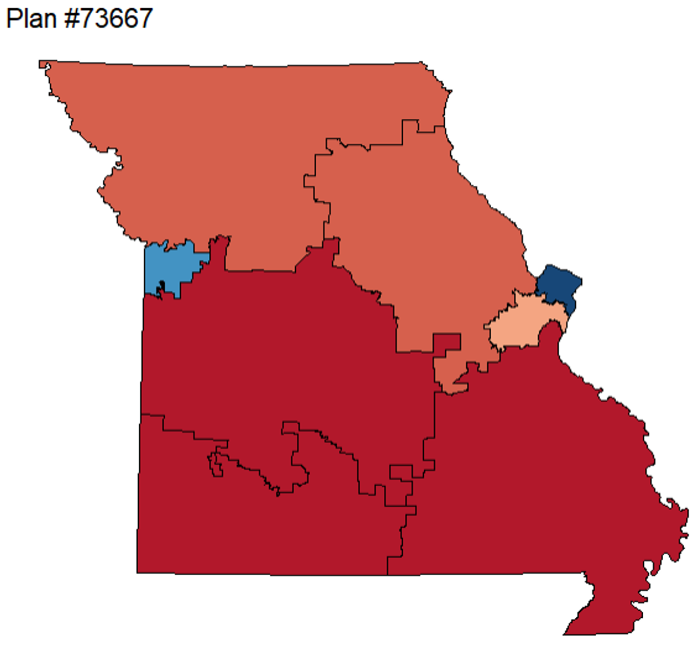
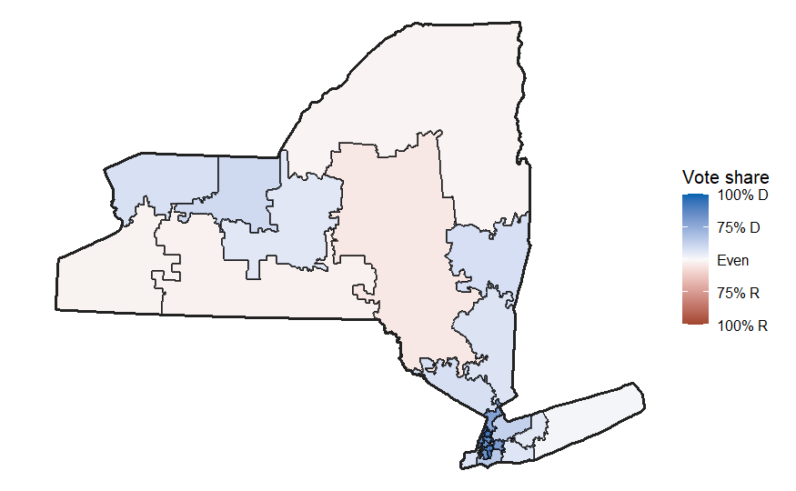
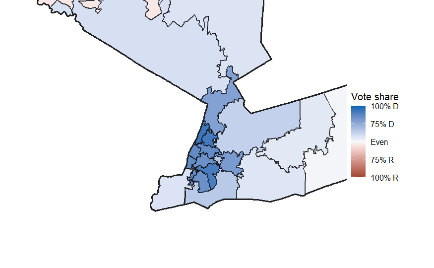
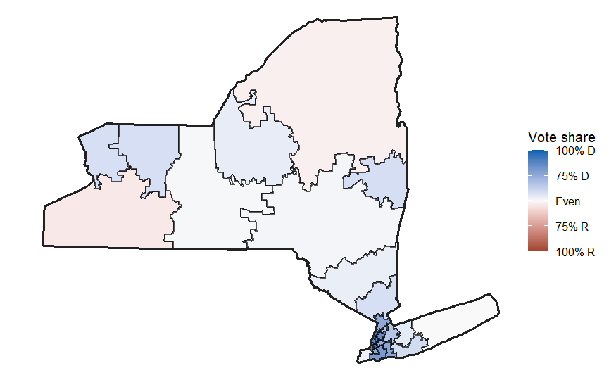
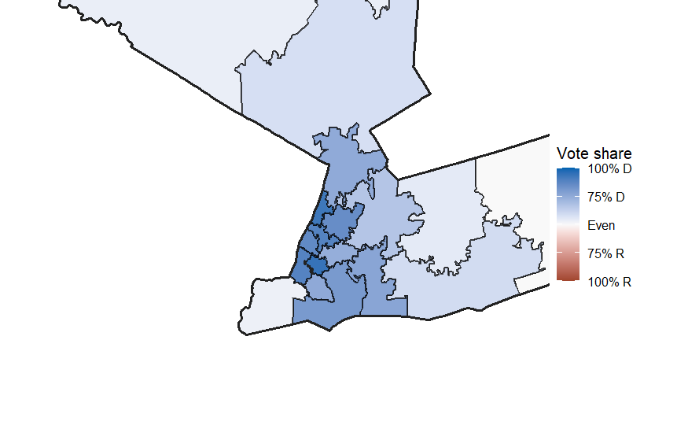

```{r echo=FALSE, setup, include=FALSE}
knitr::opts_chunk$set(
  echo = FALSE,
  warning = FALSE,
  message = FALSE
)
library(tidyverse)
library(openintro)
library(alarmdata)
library(sf)
library(ggplot2)
library(redist)
library(dplyr)
```

## Abstract

Redistricting is the process of updating congressional district boundaries to account for changes in population distribution over time. Our team analyzed the process of redistricting by targeting two states, New York and Missouri. Interestingly, both of these states initiated the redistricting process mid-decade, either voluntarily or as a result of litigation, which is unusual. Our research began by identifying why each state enacted mid-decade redistricting and by learning how to recreate variations of their recent redistricting plans. After our initial research, our team defined the long-term goal of creating our own competitive (gerrymandered) and fair variations for each state. In addition, our team paid special attention to New York's District 11 during our gerrymandering process, as it is currently the subject of a redistricting dispute.
During our redistricting experiments, we used the SMC algorithm from the Alarm Project extensively. To gerrymander Missouri, we aimed to strengthen the state’s existing Republican advantage, and found that our best effort closely mirrored the state’s current boundaries. To gerrymander New York, we aimed to improve minority voting power in District eleven and increase overall Democratic voting power in the rest of the state. To fairly redistrict both states, we mainly relied on the fairness measure of compactness and used a cross-referencing process to determine the most common distribution of Democratic and Republican districts produced by the SMC algorithm. Surprisingly, we found that New York’s official 2020 district plan outranked all of our generated attempts according to our standard of fairness.   

### Introduction

Every ten years, the boundaries of congressional districts in the United States are redrawn following the national census. Known as congressional redistricting, it creates the potential to reshape political representation for millions of voters across the states. These district boundaries are crucial in influencing electoral outcomes which have made congressional redistricting one of the most politically significant and controversial aspects in American democracy. For some context, a congressional district is a specific geographic area within a U.S state that elects exactly one member to the United States House of Representatives. Because there are 435 seats in the House of Representatives, there are 435 districts spread throughout the United States. 
  
There are a few rules which dictate how these 435 congressional districts are spread to each state. The first being what was briefly stated in the beginning, which is that following the decennial census which is every 10 years, states must redraw congressional district boundaries to reflect population changes. This leads into the next rule which requires all congressional districts to be roughly equal in population size. The rules for district populations vary depending on whether your comparing districts in the same state vs different states. Within the same state, districts must have nearly identical populations as the "one person, one vote" standard requires states to draw districts that prevents them from having unbalanced districts. But across different states it's a little different as the 435 seats are divided among the states based on their overall population. 
  
In addition to that, there are also compactness and contiguous laws, but they aren't federal law for all states. Compactness meaning that a district should feature a regular consolidated shape with smooth boundaries rather than being elongated or sprawling. Contiguity means that all areas within a district are to be physically connected to one another. Different state legislatures are allowed a significant amount of freedom to conduct their redistricting process which has created many unique problems. More specifically the idea of gerrymandering. Gerrymandering refers to the practice of drawing electoral district boundaries in a way that clearly advantages a particular political party. You will understand more about gerrymandering when we get into the context of our two states. 

  
### New York & Missouri context

Missouri and New York are two very different states. On one hand, New York is a pretty democratic heavy state with a large population, which has a total of 26 districts. But it's important to note that New York's districts have been dwindling down as even after this 2020 census, they lost their 27th district. While Missouri is known as more of a heavy republican state with only 8 congressional districts.
  
New York has a dense urban concentration in its state, specifically with the dominant New York City. New York City itself consists of 13 congressional districts which takes up most of the southern part of the state. Upstate New York is a lot different than its New York City counterpart. Upstate New York still has many heavily clustered voters in cities like Buffalo, Rochester, Albany, and Syracuse. But most of these cities are confined to one district while districts around these cities are majority rural land. This creates a major population balance between urban and rural areas. Almost all of the democratic votes for New York come from these urban cities while the rural areas mainly consist of republicans besides a few minor exceptions like Staten Island and parts on Long Island in NYC. New York remains a democratic powerhouse and has a documented history of drawing electoral districts to maximize democratic seats, especially after the 2020 census. the New York State Legislature, controlled by democrats, bypassed the bipartisan redistricting commission to pass their own aggressively gerrymandered map.   

  
```{r code-chunk-label, echo=FALSE}
ny_alarm<- alarm_50state_map("NY") 

ny_district_outlines <- ny_alarm |>
  group_by(cd_2020) |>
  summarize(geometry = st_union(geometry))

ggplot() +
  geom_sf(data = ny_alarm, aes(fill = adv_20 / (adv_20 + arv_20)), color = "NA")  +
  
  geom_sf(data = ny_district_outlines, fill = NA, color = "black", linewidth = 0.5) +
  scale_fill_gradientn(
    colors = c("#E91D0E", "#FFB6B6", "#B0C4DE", "#0015BC"),
    values = c(0, 0.499, 0.501, 1),
    name = "Partisan Lean"
  ) +
  theme_void() +
  labs(title = "NY District Partisan lean 2020 Map")
 

```

```{r echo=FALSE}
ny_cd <- ny_alarm |>
  group_by(cd_2020) |>
  summarize(
    dem_votes = sum(adv_20, na.rm = TRUE),
    rep_votes = sum(arv_20, na.rm = TRUE)
  ) |>
  mutate(
    dem_share = dem_votes / (dem_votes + rep_votes)
  )

ggplot(ny_cd) +
  geom_sf(aes(fill = dem_share),
          color = "black",
          linewidth = 0.3) +
  scale_fill_gradient2(
    midpoint = 0.5,
    low = "red",
    mid = "white",
    high = "blue",
    labels = scales::percent
  ) +
  labs(
    title = "New York Congressional District Partisan Lean 2020 Map",
    fill = "Democratic Vote Share"
  ) +
  theme_void()
```

For our analysis we specifically looked at New York district 11 which consists of Staten Island and parts of Brooklyn.This is because of the current court case that is unfolding in this district. The initial ruling on January 21st of 2026 a New York State Supreme Court judge ruled that the NY-11 district lines were unconstitutional because it dilutes the voting power of Black and Latino residents under the state constitution. But as of March 2nd, the U.S Supreme Court has paused the lower court redraw order. We will be looking at how this district is diluting minority voting power while trying to create a minority favored district 11 that passes state law. 
  
```{r echo=FALSE}
ny_11 <- ny_alarm |>
  filter(cd_2020 == 11) |>
  mutate(
    minority_pct = (vap-vap_white) / (vap) * 100
  )

ny11_outline <- ny_alarm |>
  filter(cd_2020 == 11) |>
  summarize()
  
ggplot() +
  geom_sf(
    data = ny_11,
    aes(fill = minority_pct),
    color = "white",
    linewidth = 0.03
  ) +
  geom_sf(
    data = ny11_outline,
    fill = NA,
    color = "black",
    linewidth = 0.8
  ) +
scale_fill_viridis_c(
  name = "% Minority",
  labels = scales::label_percent(scale = 1)
)+
  labs(
    title = "Minority Voting Age Population in NY-11",
  ) +
  theme_void()
```

So, going away from the urban complexities of New York state, Missouri is quite literally the opposite. Missouri consists of roughly 60% republicans and 40% democratic. Missouri only consists of really two major cities being Kansas City and St. Louis. Outside of those major cities only a few other small pockets of Missouri consist of urban areas. Rural land dominates most of Missouri which has created a heavily favored republican state legislature. The 2020 census saw a 6-2 republican majority with the 2 democrat districts being the concentrated packing of Kansas City and St. Louis. There has been no court orders to mid-decade redistrict in Missouri. Missouri Supreme Court ruled that lawmakers are allowed to redraw district maps outside of the standard decennial census cycle. This has allowed for the Missouri state legislature to push for a redraw of congressional district lines to try and gain a stronger 7-1 majority. This is seen as a highly aggressive gerrymandering plot. Especially because the new plans crack Missouri district 5 into multiple districts. District 5 consisted of the heavy democratic Kansas City voters and the idea was to split them up into the surrounding districts with heavy republican voters to dampen the the overall democratic vote. 
  
```{r echo=FALSE}
mo_alarm <- alarm_50state_map("MO")

mo_district_outlines <- mo_alarm |>
  group_by(cd_2020) |>
  summarize(geometry = st_union(geometry))

ggplot() +
  geom_sf(data = mo_alarm, aes(fill = adv_20 / (adv_20 + arv_20)), color = "NA")  +
  
  geom_sf(data = mo_district_outlines, fill = NA, color = "black", linewidth = 0.5) +
  scale_fill_gradientn(
    colors = c("#E91D0E", "#FFB6B6", "#B0C4DE", "#0015BC"),
    values = c(0, 0.499, 0.501, 1),
    name = "Partisan Lean"
  ) +
  theme_void() +
  labs(title = "MO District Partisan lean 2020 Map")
```

```{r echo=FALSE}
mo_cd <- mo_alarm |>
  group_by(cd_2020) |>
  summarize(
    dem_votes = sum(adv_20, na.rm = TRUE),
    rep_votes = sum(arv_20, na.rm = TRUE)
  ) |>
  mutate(
    dem_share = dem_votes / (dem_votes + rep_votes)
  )

ggplot(mo_cd) +
  geom_sf(aes(fill = dem_share),
          color = "white",
          linewidth = 0.3) +
  scale_fill_gradient2(
    midpoint = 0.5,
    low = "red",
    mid = "white",
    high = "blue",
    labels = scales::percent
  ) +
  labs(
    title = "Missouri Congressional District Partisan Lean 2020 Map",
    fill = "Democratic Vote Share"
  ) +
  theme_void()
```

### MO New Map Plans

Here is the new proposed Missouri congressional districts map. What you will notice about this map is that the St. Louis and 2 southern districts mostly remain the same. But old Missouri District 5, which makes of almost entirely Kansas City, has been completely split apart into multiple districts. This is a gerrymandering tactic called cracking as the republican are trying to split up the democratic votes in old district 5 into multiple districts so the democratic votes are diluted.

```{r echo=FALSE, message=FALSE, warning=FALSE}
mo_new_cd <- suppressMessages(
  st_read("HB1_Missouri_Congressional_Districts_2025")
)

ggplot(mo_new_cd) +
  geom_sf(aes(fill = factor(District)),
          color = "white",
          linewidth = 0.3) +
  guides(fill = "none") +
  theme_void() +
  labs(
    title = "Missouri Proposed Congressional Plan"
  )
```

### Goals for our Research 
  
Just the context behind these two states redistricting troubles show the complexities of congressional redistricting. This project aims to explore the mathematical and political sides to redistricting by analyzing two geographically and politically distinct states: New York and Missouri. To evaluate the integrity and structure of our map plans, we use two main metrics. The Polsby_Popper score and the Reock degree of compactness. Explanation about how these metrics work will be described farther down in this report. But with these metrics, this project aims to execute three distinct mapping objectives: the creation of a fair New York & Missouri map, maximization of partisan advantage maps for New York & Missouri, and Optimization of minority voting power in New York district 11. Creating a fair map for both states will be highly compact and contiguous while also prioritizing partisan fairness. maximizing partisan advantage maps will be the opposite of our fair maps. We will intentionally construct biased maps for both states to demonstrate how easily boundaries can be bent and turned to favor a specific political party. New York will be gerrymandered in favor of democrats while Missouri will be in favor of republicans. Lastly we decided to take extra time in specifically looking at the New York district 11 and its surrounding districts. Because of the active court case we felt the need to separately analyze this area from the rest of New York. Our goal for NY-11 is to reshape the district to heavily support minority voting power. So, we are basically gerrymandering to support minorities. 


## Methods

### Data Sources

The Alarm Project provides precinct level demographic and election data aggregated from two different sources.

First, the US Census Bureau’s decennial census aims to accurately provide block level population data necessary for ensuring congressional districts represent equal portions of the population. The most recent census process utilized an online self-response survey with in-person follow up attempts for non-respondents. Given the scale of the project, it is impossible for the US Census Bureau to accurately count every US citizen, but it is the best approximation that exists.

Second, the Voting and Election Science Team (VEST) provides precinct level election data. VEST attempts to aggregate precinct level data by contacting officials directly for election records. VEST also claims to modify received precincts if they verify errors. As VEST aims to aggregate data representative of the US population, due to scale, the data is likely not complete.

The Alarm Project has merged the discussed decennial census data and VEST election data at the precinct level, with the process available at: https://github.com/alarm-redist/census-2020.

Some of our data also came from the U.S. Census Bureau's 2020 Decennial Census. It was mainly collected via legal mandate. This was an observational census. Because this data is a census rather than a random sample, it represents the 100% absolute population baseline rather than a statistical inference. To first use the data, a one-time API key was needed to access the data which was emailed and verified. Then using the tidycensus package, the get_decinnial() command was executed to pull targeted 2020 population and voting-age demographic data. This data contained counties, districts, census blocks, and census tracts. This data was mainly just explored to gage whether it would be a good addition to the alarmdata package. Data between the two sources was never fully merged but a few maps were created that had demographic data from the Census Bureau and a geom_sf that contained outlines of districts from alarmdata. 

### Data Combination

For redistricting New York district eleven in particular, we combined precinct level data from the Alarm Project with boundaries from the Redistricting Data Hub. The Redistricting Data Hub provides past and current district boundaries but no other data. As a result, when working with boundaries from the Redistricting Data Hub, spacial joins were regularly used to relate data and position.

### Variables Used

Variables used, population, ndv (democrat vote), nrv (republican vote), Created variables such as vote_tot for sum of votes from ndv and nrv. Created the variable dem_vote which used for democrat vote share. Along with the variable minority which was a combination of all minority in each precinct. 

### Process

Plans were generated using the redist package, which used Sequential Monte Carlo (SMC) to create generated continuous and similar population districts. The plans were created:
redist_map(map_NY, existing_plan = cd_2020, pop_tol = 0.01)

A population tolerance of 1% was used, meaning no district could deviate more than 1% from each other. cd_2020 is the existing plan we used for boundaries and comparison. SMC is algorithm that creates randomly generated maps, it basically brute forces map creation and can give you thousands of maps to work with. It gets better as it runs by looking at different ways it came to the answer. 

After creating these plans we would then run data analysis and statistics on them. We first created a variable for compactness by using the redist package that gives each district a rating for compactness. The equation that it uses for compactness is polsby-popper. Compactness = 4pi * Area / Perimeter squared. Another measure of compactness used was reock, the score is compactness = District area / minimum bounding circle area. Minimum bounding circle area means the area of the smallest circle that would completely enclose it. 

After that we created a scoring method to rank our districts. Our main criteria for scoring was using compactness since it has the least bias or conflicts when used. How we would score is for each compactness score we would do the average of all the compactness for each plan, giving it a weight by multiplying it by 0.8. Then finding the min of the district of each respective plan and giving it a weight by multiplying by 0.2. This allowed for taking averages of all districts while also accounting for outliers of non-compact districts. Then we would add them together to create a compactness score. After creating a score for each measure of compactness we weighted polsby popper with a weight of 0.6 since it is the most statistically used for compactness. Then gave a 0.3 weight to reock score, to have different measures of compactness to be more accurate. Our last measure into our score was 0.1 for average of population deviation to award plans more equal population size. This method we believe is the most “fair” and unbiased. 

Created a variable called dem_district which would say whether a district after SMC was won by over 5% to be a “safe” democrat district. Using that we would then run statistics on dem_districts for all our plans. We would find the mean, median, and standard deviation. Using that we would filter our plans by only the mean and a standard deviation away to only allow for the most common types of plans to be used. With creating our gerrymandered plans we would filter by the max or min number of dem_districts based on what we were looking for. This allowed for us to have uncommon plans like 7 republican districts in Missouri. This is how we are came up with our final plans.

This allowed for the creation of “fair” plans based on compactness and being very common. It also allowed for plans that are compact while also being uncommon, allowing for potential gerrymandering and potentially legal while being gerrymandered. 

## Results

For the creation of our custom redistricting we first created many thousands of plans using SMC. We created 100,000 for Missouri and 20,000 for New York. After the creation of these plans we ran statistical analysis on them, an example is how common some criteria is compared to others. Below is a histogram of all for plans for Missouri and the count of plans that had a total number of republican districts winning by 5% or more. 


As you can see five republican districts are by far the most common when randomly redistricting when using SMC. Based on the statistics it is very uncommon for a plan to have 7 republican districts winning by 5%. Of our 100,000 plans only four plans had seven or more republican districts winning by 5%. This shows how uncommon the 2025 redistrict for Missouri was, that is a 0.004% chance of happening using our method of SMC. Below is a graph of each district for Missouri, each black dot is one of our generated plans, with the orange line being the 2020 plan. 


For district one and five 2020 plans are near the max of democrat percent vote for all our generated plans, showing how very uncommon it is. You can tell they did packing for district 1 and 5 by packing all the democrats into each district. This also allows for the other districts to be on the lower end of the democrat percent vote due to all this. You could argue this plan was also gerrymandered due to how uncommon the plans are and how they benefit the republican party.


After running statistical analysis on New York for our 20,000 plans using the same criteria except democrats winning by 5%. Below is our histogram for New York plans. 


The most common count of democrat districts are 16, 17, and 18. The mean is 17.5 with a standard deviation of 1, we then filtered our data for only 16-18 democrat districts. New Yorks 2020 plan has 19 democrat districts winning by 5% which is not that uncommon but not common. Based on the data it is about a 12.1% chance to get 19 or more.

For creating the map for gerrymandering New York we first dropped districts 10 and 11 from our plans, this was due to creating district 10 and 11 separately. We took the same approach for creating the fair MO plans besides we dropped some districts. We then filtered by which one of our plans had the max number of Democrat districts won by 5% or more. The max number of democratic districts we had out of 20,000 was 20 out of the 24 since district 10 and 11 was removed from the data. We then created district 10 and 11 by

### MAPS

By filtering by the max number of republican districts and then choosing the most compact district with our ratings. We are given a map with 7 Republican districts all winning by 5% or more. The least strong republican district is winning by 5.08% with the strongest winning by 26.3%. The only democrat district is 74.4% democrat. It is given a average polsby popper score of 0.192 and the lowest of polsby popper 0.094. It has a reock score of 0.455 and min of 0.307. Below is our Gerrymandered plan, the next one below is the 2025 legal Missouri plan. 


{width=70% height=70%}


{width=70% height=70%}


Our redistrict plan for gerrymandering is extremely similar 2025 legal plan. Both plans have seven districts that are over 5% republican winning. Along with one district that is winning by over 15% democrat. Both of the southern districts are deep red winning by over 15%, while the northern districts are winning by 5%. Both plans take a similar approach to breaking up the previous district five from the 2020 legal plan. Both plans broke up district five Kansas city into three different districts. This term would be referred to as cracking, where you dilute the vote of a certain party by cracking them into different districts. Then both plans pack St. Louis district one into one district. Packing is when you pack all of one party into one district to make one district the party can win so other party wins the remaining districts. Based on this analysis there is a high likely 2025 plan was gerrymandered but due to being compact, contiguous, similar populations, and not breaking up communities it was able pass. 

### Fair MO

For creating the fair Missouri plan we first filtered by what is criteria is the most common. The most common trait was to have five republican district winning by 5%. After that our main critrea is compactness due to it having the least amount of bias and being one of the best statistical values for fairness. Our most “fair” plan had a polsby popper score of 0.240 with a min of 0.176. Then for reock it was given a 0.480 for compactness, and a min of 0.389. For population deviation it was given a 0.607. This had one of the highest compactness scores of our plans and also the best population deviation score. This gave us a total score of 0.977 after our weighting. 

For creating the fair New York plan we first dropped districts 10 and 11 from our plans, this was due to creating district 10 and 11 separately. We took the same approach for creating the fair MO plans besides we dropped some districts. We filtered out by what we decided was normal and most common. Then was graded with our weighting scale of compactness and small weight for population deviation.


{width=70% height=70%}


\n

Our plan gives us both a district for Kansas City as well for St. Louis. This is due to with the cities they are rewarded for making districts there to be more compact. What helps make this map fair is it helps account for local fairness while also helping with global fairness. It gives the cities which are big enough to have their own districts their own districts while also allowing for rural areas to have their own districts. Roughly 40% of Missouri is democrat creating a 2/7 (28.5%) districts democrat being around 30% along with another district potential swinging democrat. 3/7 districts is roughly 42% which would be over representative, so this is a good match for being locally fair and globally fair while also reducing bias due to only redistricting based on most common plans and compactness.

### Gerrymander NY

By filtering by the max number of Democrat districts and then choosing the most compact district with our ratings. We are given a map with 21 Democrat districts winning by 5% or more. The least strong Democrat district is winning by 51% so it ends up being competive with a Democrat advantage.   The strongest winning by Democrat district by  43.2%. Our desired plan after using our compactness rating had a polsby popper score of 0.225, reock score of 0.413, and population deviation of 0.231, creating a total score of 0.831. Our most republican district was only winning by 4.4%, creating non safe republican districts with our gerrymander.

In addition to gerymandering the entirety of New York, we were able increase minority voting power in district eleven specifically, attempting to reflect recent litigation. This was accomplished by dividing districts ten and eleven into Statin Island and mainland pieces, and then splitting the mainland into valid, equal sized parts that could potentilly be joined to district eleven. Then, the results were filtered for highest minority voting age population. For an interactive comparison, visit: https://fcgreen6.github.io/DAT4500-project-interactive/pages/district-11-interactive/main.html

{width=70% height=70%}

{width=70% height=70%}


### Fair NY

Our most fair plan based on our fair criteria was actually the 2020 legal plan which was an interesting find. Due to this we ended up choosing the next best plan which had a 0.237 poslby popper score, 0.442 score for reock and 0.063 population deviation. While 2020 plan had a 0.367 poslby popper score, 0.415 score for reock and 0.671 population deviation. This gave us a total score of 0.957 for 2020 legal and 0.876 for our plan after our weighting. After that we then recreated the district 10 and 11 plans.

{width=70% height=70%}

{width=70% height=70%}

### Discussion

The goal of this project was to evaluate and redesign congressional districts in Missouri and New York using compactness as our main criteria. Specifically, we focused on creating both fair and gerrymandered plans. Interestingly enough our fair Missouri plans gave much of the same result, of the 6-2 republican majority, as the regular cd_2020 map gives us. Both Kansas City and St. Louis are the two democratic districts while the heavy rural middle and south districts are dark red. This shows that when it comes to making a fair Missouri map there is not much else you can do to make it more fair for the democrats because of the demographics and shape of the state. Similar to the fair Missouri map, a gerrymandered Missouri map also can't get much better than the 7-1 republican majority. Out of our thousands of plans it was made clear that there was no easy way to split up both Kansas City and St. Louis because of the amount of democratic voters in these two cities. Splitting both these cities up allows for less strong republican districts that could be easily swayed democrat in the right circumstances. 
  
Our new maps for New York saw different effects compared to our Missouri fair and gerrymandered map. For the gerrymandering of New York, we were able to combine our New York plans with our separate redistricted NY-11 and get almost all of the republican districts to at least be more competitive besides one district. This created a lot of districts with small snaked like features which were grabbing specific voters to different districts. What you'll notice when comparing the gerrymandered and fair map is in New York City, most of the districts don't change much. This is because the core of New York City is a very deep blue of heavy democratic supporters. No matter how you redraw district lines in downtown New York, it will still get you a majority democratic vote. 


### Limitations

We had many goals for our project and areas we wanted to improve on. Sadly, we could not accomplish all our goals and improve in areas. We were limited by the amount of time we could set toward our goals. For example, we wanted to improve our fairness, when only going for compactness, you can end up with breaking up groups which is unfair. We wanted to create a way to keep groups intact, but we did not have enough time or resources to accomplish this goal. 

Another limitation was the data we had was not perfect. For example, when redistricting New York was New York has many bodies of water. The precinct data would go over bodies of water or include bodies of water making it difficult to make New York accurately. This also created the issue of keeping your districts contiguous since it viewed the water as land when it was not. Redistricting district 10 and 11 became a challenge due to the large body of water between them and occasionally going over the water.

## Sources:

- Redistricting Data Hub Boundaries:
  - Missouri 2020: <https://redistrictingdatahub.org/dataset/2022-missouri-congressional-districts-approved-plan/>
  - Missouri Mid-Decade: <https://redistrictingdatahub.org/dataset/2025-missouri-congressional-districts-plan/>
  - New York 2020: <https://redistrictingdatahub.org/dataset/2022-new-york-congressional-districts-plan/>
  - New York Mid-Decade: <https://redistrictingdatahub.org/dataset/2024-new-york-congressional-districts-plan-approved/>
- Alarm Project Data;
  - VTD Downloads: <https://alarm-redist.org/posts/2021-08-10-census-2020/>  
- Reock compactness: <https://doi.org/10.2307/2109043>
- Fairness: <https://arxiv.org/pdf/2210.11643>
