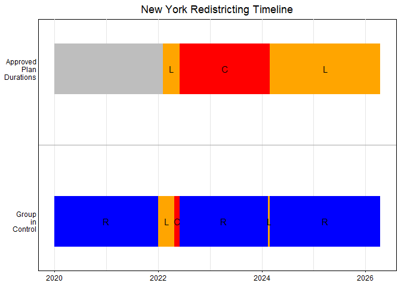
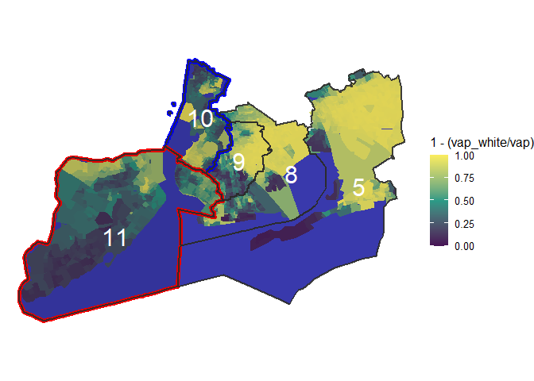
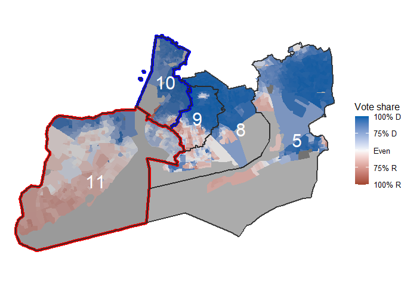

# New York Redistricting Timeline

-   **Description:**
    -   A timeline of redistricting events in New York following the
        2020 census. Data manually collected from:
        <https://redistricting.lls.edu/state/new-york/?cycle=2020&level=Congress&startdate=2022-02-03>.

# New York Extended Minority Map

-   **Description:**
    -   An extended version of Nick’s minority map which attempts to
        better capture what is happening in district 11.

<!-- -->

    ## Reading layer `con24' from data source 
    ##   `C:\development\r\DAT4500-project\fletcher\shape-files\ny-new-shape\CON24_shapefile_Feb_28_2024\con24.shp' 
    ##   using driver `ESRI Shapefile'
    ## Simple feature collection with 26 features and 2 fields
    ## Geometry type: MULTIPOLYGON
    ## Dimension:     XY
    ## Bounding box:  xmin: 105571.2 ymin: 4480943 xmax: 770761.9 ymax: 4985476
    ## Projected CRS: NAD83 / UTM zone 18N

# New York Extended Vote Share Map

-   **Description:**
    -   Recolored version of the minority map above attempting to
        display vote share.

<!-- -->

    ## Reading layer `con24' from data source 
    ##   `C:\development\r\DAT4500-project\fletcher\shape-files\ny-new-shape\CON24_shapefile_Feb_28_2024\con24.shp' 
    ##   using driver `ESRI Shapefile'
    ## Simple feature collection with 26 features and 2 fields
    ## Geometry type: MULTIPOLYGON
    ## Dimension:     XY
    ## Bounding box:  xmin: 105571.2 ymin: 4480943 xmax: 770761.9 ymax: 4985476
    ## Projected CRS: NAD83 / UTM zone 18N

