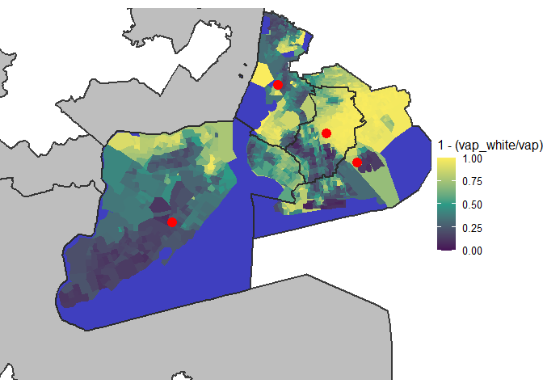

# Initial Interactivity

### Tidy Data

    # Read geometry of districts.
    nyNewDistricts <- st_read(
      "../shape-files/ny-new-shape/CON24_shapefile_Feb_28_2024/con24.shp"
    )

    ## Reading layer `con24' from data source 
    ##   `C:\development\r\DAT4500-project\fletcher\shape-files\ny-new-shape\CON24_shapefile_Feb_28_2024\con24.shp' 
    ##   using driver `ESRI Shapefile'
    ## Simple feature collection with 26 features and 2 fields
    ## Geometry type: MULTIPOLYGON
    ## Dimension:     XY
    ## Bounding box:  xmin: 105571.2 ymin: 4480943 xmax: 770761.9 ymax: 4985476
    ## Projected CRS: NAD83 / UTM zone 18N

    njDistricts <- st_read(
      "../shape-files/nj-shape/nj_cong_2021.shp"
    )

    ## Reading layer `nj_cong_2021' from data source 
    ##   `C:\development\r\DAT4500-project\fletcher\shape-files\nj-shape\nj_cong_2021.shp' 
    ##   using driver `ESRI Shapefile'
    ## Simple feature collection with 12 features and 12 fields
    ## Geometry type: POLYGON
    ## Dimension:     XY
    ## Bounding box:  xmin: -75.56359 ymin: 38.78866 xmax: -73.88506 ymax: 41.35761
    ## Geodetic CRS:  WGS 84

    # Remove unnecessary data and rename cols so that they match what is expected
    # by BlockManager.
    nyNewDistrictBlocks <- nyNewDistricts |>
      select(OBJECTID, DISTRICT, geometry) |>
      mutate(STATE = "NY")

    njDistrictBoundaries <- njDistricts |>
      select(ID, DISTRICT, geometry) |>
      rename(OBJECTID = ID) |>
      mutate(STATE = "NJ")

    njDistrictBoundaries <- st_transform(njDistrictBoundaries, st_crs(nyNewDistrictBlocks))
    nyNewDistrictBlocks <- rbind(nyNewDistrictBlocks, njDistrictBoundaries)
    nyNewDistrictBlocks <- st_snap(nyNewDistrictBlocks, nyNewDistrictBlocks, tolerance = 1)

    dist11Adj <- st_touches(nyNewDistrictBlocks)[11]

    nyNewDistrictBoundaries <- nyNewDistrictBlocks[c(11, dist11Adj[[1]]),]
    nyNewDistrictBlocks <- nyNewDistrictBlocks[c(11, dist11Adj[[1]]),]

    nyNewDistrictBlocks <- nyNewDistrictBlocks |>
      filter(STATE == "NY")
    njDistrictBoundaries <- nyNewDistrictBoundaries |>
      filter(STATE == "NJ")
    nyNewDistrictBoundaries <- nyNewDistrictBoundaries |>
      filter(STATE == "NY")

    # Read block level data. Change col names so that they match what is
    # expected by BlockManager.
    nyData2020 <- read.csv("../csv/ny_2020_vtd.csv")

    nyData2020 <- nyData2020 |>
      rename(GEOID = GEOID20) |>
      select(nrv, ndv, vap, vap_white, vap_hisp, vap_black, GEOID) |>
      mutate(GEOID = as.character(GEOID))

    # Get blocks and join block level data to it.
    nyAllBlocks2020 <- BlockManager$GetBlocks("NY")
    nyAllBlocks2020 <- BlockManager$JoinByGeoid(nyAllBlocks2020, nyData2020)
    nyNewDistrictBoundaries <- BlockManager$ConsolodateDistricts(nyNewDistrictBoundaries, nyAllBlocks2020)

    # Translate CRS and make blocks into centroids.
    nyNewDistrictBlocks <- st_make_valid(nyNewDistrictBlocks)
    centrailizedBlocks <- st_make_valid(nyAllBlocks2020)
    centrailizedBlocks <- st_transform(centrailizedBlocks, st_crs(nyNewDistrictBlocks))
    centrailizedBlocks <- st_point_on_surface(centrailizedBlocks)

    # Perform spatial join.
    nyNewDistrictBlocks <- st_join(
      nyNewDistrictBlocks,
      centrailizedBlocks,
      join = st_intersects
    )

    st_geometry(nyNewDistrictBlocks) <- st_geometry(nyAllBlocks2020)[
      match(nyNewDistrictBlocks$GEOID, nyAllBlocks2020$GEOID)
    ]

    nyWaterBlocks <- NULL
    for (i in seq_len(nrow(nyNewDistrictBlocks))) {
      if (nyNewDistrictBlocks$vap[i] == 0) {
        nyWaterBlocks <- rbind(nyWaterBlocks, nyNewDistrictBlocks[i,])
      }
    }

    njDistrictBoundaries <- st_transform(
      njDistrictBoundaries, 
      st_crs(nyNewDistrictBlocks)
    )
    nyNewDistrictBoundaries <- st_transform(
      nyNewDistrictBoundaries, 
      st_crs(nyNewDistrictBlocks)
    )
    nyWaterBlocks <- st_transform(
      nyWaterBlocks, 
      st_crs(nyNewDistrictBlocks)
    )

    rm(nyData2020)
    rm(nyAllBlocks2020)
    rm(centrailizedBlocks)
    rm(dist11Adj)
    rm(nyNewDistricts)
    rm(njDistricts)

### Make Plot Boundaries

    # Read geometry of districts.
    nyNewDistricts <- st_read(
      "../shape-files/ny-new-shape/CON24_shapefile_Feb_28_2024/con24.shp"
    )

    ## Reading layer `con24' from data source 
    ##   `C:\development\r\DAT4500-project\fletcher\shape-files\ny-new-shape\CON24_shapefile_Feb_28_2024\con24.shp' 
    ##   using driver `ESRI Shapefile'
    ## Simple feature collection with 26 features and 2 fields
    ## Geometry type: MULTIPOLYGON
    ## Dimension:     XY
    ## Bounding box:  xmin: 105571.2 ymin: 4480943 xmax: 770761.9 ymax: 4985476
    ## Projected CRS: NAD83 / UTM zone 18N

    nyCustomDistricts <- st_read(
      "../custom-files/dist-11-custom/custom-bounds.shp"
    )

    ## Reading layer `custom-bounds' from data source 
    ##   `C:\development\r\DAT4500-project\fletcher\custom-files\dist-11-custom\custom-bounds.shp' 
    ##   using driver `ESRI Shapefile'
    ## Simple feature collection with 2 features and 2 fields
    ## Geometry type: POLYGON
    ## Dimension:     XY
    ## Bounding box:  xmin: 465064.2 ymin: 67603.53 xmax: 471699.3 ymax: 85810.41
    ## Projected CRS: NAD83(HARN) / New York Central

    njDistricts <- st_read(
      "../shape-files/nj-shape/nj_cong_2021.shp"
    )

    ## Reading layer `nj_cong_2021' from data source 
    ##   `C:\development\r\DAT4500-project\fletcher\shape-files\nj-shape\nj_cong_2021.shp' 
    ##   using driver `ESRI Shapefile'
    ## Simple feature collection with 12 features and 12 fields
    ## Geometry type: POLYGON
    ## Dimension:     XY
    ## Bounding box:  xmin: -75.56359 ymin: 38.78866 xmax: -73.88506 ymax: 41.35761
    ## Geodetic CRS:  WGS 84

    # Remove unnecessary data and rename cols so that they match what is expected
    # by BlockManager.
    nyNewDistrictBlocks <- nyNewDistricts |>
      select(OBJECTID, DISTRICT, geometry) |>
      mutate(STATE = "NY")

    njDistrictBoundaries <- njDistricts |>
      select(ID, DISTRICT, geometry) |>
      rename(OBJECTID = ID) |>
      mutate(STATE = "NJ")

    njDistrictBoundaries <- st_transform(njDistrictBoundaries, st_crs(nyNewDistrictBlocks))
    nyNewDistrictBlocks <- rbind(nyNewDistrictBlocks, njDistrictBoundaries)
    nyNewDistrictBlocks <- st_snap(nyNewDistrictBlocks, nyNewDistrictBlocks, tolerance = 1)

    dist11Adj <- st_touches(nyNewDistrictBlocks)[11]

    nyNewDistrictBoundaries <- nyNewDistrictBlocks[c(11, dist11Adj[[1]]),]
    nyNewDistrictBlocks <- nyNewDistrictBlocks[c(11, dist11Adj[[1]]),]

    nyNewDistrictBlocks <- nyNewDistrictBlocks |>
      filter(STATE == "NY")
    njDistrictBoundaries <- nyNewDistrictBoundaries |>
      filter(STATE == "NJ")
    nyNewDistrictBoundaries <- nyNewDistrictBoundaries |>
      filter(STATE == "NY") |>
      #filter(DISTRICT != 10 & DISTRICT != 11) |>
      select(DISTRICT, geometry) |>
      mutate(OBJECTID = DISTRICT)

    #nyCustomDistricts <- st_transform(nyCustomDistricts, st_crs(nyNewDistrictBoundaries))
    #nyNewDistrictBoundaries <- rbind(nyNewDistrictBoundaries, nyCustomDistricts)

    # Read block level data. Change col names so that they match what is
    # expected by BlockManager.
    nyData2020 <- read.csv("../csv/ny_2020_vtd.csv")

    nyData2020 <- nyData2020 |>
      rename(GEOID = GEOID20) |>
      select(nrv, ndv, vap, vap_white, vap_hisp, vap_black, GEOID) |>
      mutate(GEOID = as.character(GEOID))

    # Get blocks and join block level data to it.
    nyAllBlocks2020 <- BlockManager$GetBlocks("NY")
    nyAllBlocks2020 <- BlockManager$JoinByGeoid(nyAllBlocks2020, nyData2020)
    nyNewDistrictBoundaries <- BlockManager$ConsolodateDistricts(nyNewDistrictBoundaries, nyAllBlocks2020)

    # Translate CRS and make blocks into centroids.
    nyNewDistrictBlocks <- st_make_valid(nyNewDistrictBlocks)
    centrailizedBlocks <- st_make_valid(nyAllBlocks2020)
    centrailizedBlocks <- st_transform(centrailizedBlocks, st_crs(nyNewDistrictBlocks))
    centrailizedBlocks <- st_point_on_surface(centrailizedBlocks)

    # Perform spatial join.
    nyNewDistrictBlocks <- st_join(
      nyNewDistrictBlocks,
      centrailizedBlocks,
      join = st_intersects
    )

    st_geometry(nyNewDistrictBlocks) <- st_geometry(nyAllBlocks2020)[
      match(nyNewDistrictBlocks$GEOID, nyAllBlocks2020$GEOID)
    ]

    nyWaterBlocks <- NULL
    for (i in seq_len(nrow(nyNewDistrictBlocks))) {
      if (nyNewDistrictBlocks$vap[i] == 0) {
        nyWaterBlocks <- rbind(nyWaterBlocks, nyNewDistrictBlocks[i,])
      }
    }

    njDistrictBoundaries <- st_transform(
      njDistrictBoundaries, 
      st_crs(nyNewDistrictBlocks)
    )
    nyNewDistrictBoundaries <- st_transform(
      nyNewDistrictBoundaries, 
      st_crs(nyNewDistrictBlocks)
    )
    nyWaterBlocks <- st_transform(
      nyWaterBlocks, 
      st_crs(nyNewDistrictBlocks)
    )

    rm(nyData2020)
    rm(nyAllBlocks2020)
    rm(centrailizedBlocks)
    rm(dist11Adj)
    rm(nyNewDistricts)
    rm(njDistricts)

### Make Interactive Plot

    nyNewDistrictBoundaries <- nyNewDistrictBoundaries |>
      sf::st_cast("MULTIPOLYGON")
    #njDistrictBoundaries <- sf::st_make_valid(njDistrictBoundaries)

    # Used Copilot for this zooming code. TODO: Understand what it did.
    bbox <- sf::st_bbox(
      nyNewDistrictBoundaries |> filter(DISTRICT == 11)
    )
    zoom <- 1.85
    xlim0 <- mean(bbox[c("xmin","xmax")]) + 
             c(-1, 1) * diff(bbox[c("xmin","xmax")]) * zoom / 2

    ylim0 <- mean(bbox[c("ymin","ymax")]) + 
             c(-1, 1) * diff(bbox[c("ymin","ymax")]) * zoom / 2
    shrink <- 0.85
    xlim1 <- c(
      xlim0[2] - (xlim0[2] - xlim0[1]) * shrink,
      xlim0[2]
    )
    ylim1 <- c(
      ylim0[2] - (ylim0[2] - ylim0[1]) * shrink,
      ylim0[2]
    )

    #njDistrictBoundaries <- njDistrictBoundaries |>
    #  mutate(text = paste0("<b>New Jersey (For Reference)</b>"))

    #nyNewDistrictBoundaries <- nyNewDistrictBoundaries |>
    #  mutate(text = paste0("<b>District ", DISTRICT, "</b>"))

    nyTooltipPoints <- nyNewDistrictBoundaries |>
      sf::st_collection_extract("POLYGON") |>
      st_centroid() |>
      dplyr::mutate(
        text = paste0(
          "<b>District ", DISTRICT, "</b>\n",
          "nrv: ", nrv, "\n",
          "ndv: ", ndv, "\n",
          "vap_white: ", vap_white, "\n",
          "vap_black: ", vap_black, "\n",
          "vap_hisp: ", vap_hisp, "\n"
          )
      )

    # Plot districts.
    plot <- ggplot() +
    #ggplot() +
      geom_sf(
        data = nyNewDistrictBlocks, 
        color = NA, 
        aes(fill = 1 - (vap_white / vap)), 
        linewidth = 0.5
      ) +
      scale_fill_gradient2(
        low = "#461055",
        mid = "#2A9A86",
        high = "#FAEC5E",
        midpoint = 0.5,
        limits = c(0, 1)
      ) +
      theme_map() +
      geom_sf(
        data = nyWaterBlocks, 
        fill = adjustcolor("blue", alpha.f = 0.5), 
        color = NA, 
        linewidth = 1.5) +
      #geom_sf(
      #  data = nyNewDistrictBoundaries |> filter(DISTRICT == 10), 
      #  color = "blue", 
      #  linewidth = 1.0,
      #  fill = adjustcolor("white", alpha.f = 0.0)
      #) +
      #geom_sf(
      #  data = nyNewDistrictBoundaries |> filter(DISTRICT == 11), 
      #  color = "red", 
      #  linewidth = 2.0
      #) +
      geom_sf(
        data = njDistrictBoundaries, 
        color = adjustcolor("#2B2B2B", alpha.f = 0.9),
        fill = adjustcolor("gray", alpha.f = 1.0),
        linewidth = 1.0
      ) + 
      geom_sf(
        data = nyTooltipPoints,
        aes(text = text),
        color = "red",        # invisible
        size = 4           # size irrelevant if invisible
      ) +

      geom_sf(
        data = nyNewDistrictBoundaries, 
        color = adjustcolor("#2B2B2B", alpha.f = 0.9),
        fill = adjustcolor("white", alpha.f = 0.0),
        linewidth = 1.0
      ) #+
      # Used Copilot of this zooming code. TODO: Understand what it did.

      
      #for (district in nySplitDistricts) {
      #  plot <- plot +
      #    geom_sf(
      #      data = district,
      #      aes(text = paste0("<b>This is district", unique(district$DISTRICT), "</b>")),
      #      fill = adjustcolor("white", alpha.f = 0.0),
      #      color = "#2B2B2B",
      #      linewidth = 1
      #    )
      #}

      plot <- plot +
        coord_sf(
          xlim = xlim1,
          ylim = ylim1
        )
      plot

      #geom_sf_text(
      #  data = nyNewDistrictBoundaries,
      #  aes(label = DISTRICT),
      #  size = 8,
      #  color = "white"
      #)

    #plot <- ggplotly(plot, tooltip = "text")# |>
      #style(hoveron = "fill")
    #ggplotly(plot, tooltip = "text")

    #htmlwidgets::saveWidget(
    #                widget = plot, #the plotly object
    #                file = "plot.html", #the path & file name
    #                selfcontained = TRUE #creates a single html file
    #                )
