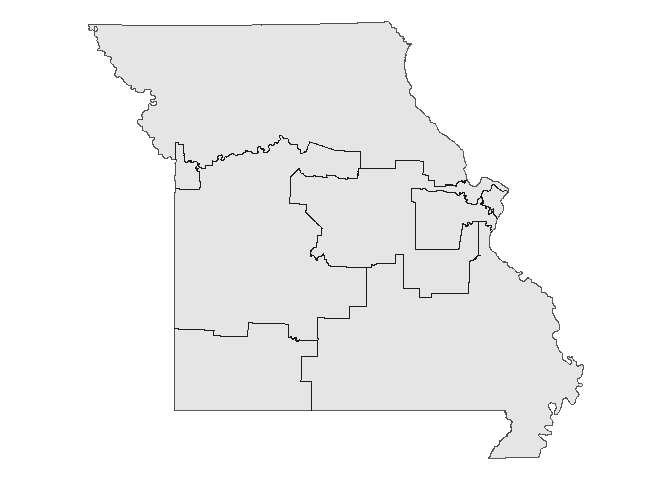
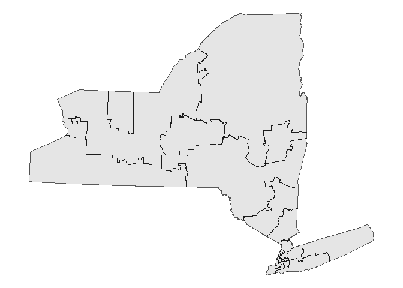

# District Comparison

-   **Overview:** Both New York and Missouri have redistricted twice
    since the 2020 census. New York is undergoing litigation and may
    redistrict a third time. This document compares the first two
    redistrictings in each state.

## Missouri

-   **Version:** This is the first map enacted by Missouri following the
    2020 census.
-   **Link to data:**
    <https://redistrictingdatahub.org/dataset/2022-missouri-congressional-districts-approved-plan/>

<!-- -->

    ## Reading layer `5799H_02T' from data source 
    ##   `C:\development\r\DAT4500-project\fletcher\district-comparison\shape-files\mo-init-shape\5799H_02T.shp' 
    ##   using driver `ESRI Shapefile'
    ## Simple feature collection with 8 features and 11 fields
    ## Geometry type: POLYGON
    ## Dimension:     XY
    ## Bounding box:  xmin: -95.7747 ymin: 35.99568 xmax: -89.09897 ymax: 40.61364
    ## Geodetic CRS:  NAD83

-   **Version:** This is the second map enacted by Missouri following
    the 2020 census.
-   **Link to data:**
    <https://redistrictingdatahub.org/dataset/2025-missouri-congressional-districts-plan/>

<!-- -->

    ## Reading layer `HB1_Missouri_Congressional_Districts_2025' from data source 
    ##   `C:\development\r\DAT4500-project\fletcher\district-comparison\shape-files\mo-new-shape\HB1_Missouri_Congressional_Districts_2025.shp' 
    ##   using driver `ESRI Shapefile'
    ## Simple feature collection with 8 features and 58 fields
    ## Geometry type: POLYGON
    ## Dimension:     XY
    ## Bounding box:  xmin: -10661590 ymin: 4300028 xmax: -9918452 ymax: 4955520
    ## Projected CRS: WGS 84 / Pseudo-Mercator

## New York

-   **Version:** This is the first map enacted by New York following the
    2020 census.
-   **Link to data:**
    <https://redistrictingdatahub.org/dataset/2022-new-york-congressional-districts-plan/>

<!-- -->

    ## Reading layer `CON22_June_03_2022' from data source 
    ##   `C:\development\r\DAT4500-project\fletcher\district-comparison\shape-files\ny-init-shape\CON22_June_03_2022.shp' 
    ##   using driver `ESRI Shapefile'
    ## Simple feature collection with 28 features and 4 fields
    ## Geometry type: POLYGON
    ## Dimension:     XY
    ## Bounding box:  xmin: 105571.2 ymin: 4480943 xmax: 770761.9 ymax: 4985476
    ## Projected CRS: NAD83 / UTM zone 18N

-   **Version:** This is the second map enacted by New York following
    the 2020 census.
-   **Link to data:**
    <https://redistrictingdatahub.org/dataset/2024-new-york-congressional-districts-plan-approved/>

<!-- -->

    ## Reading layer `con24' from data source 
    ##   `C:\development\r\DAT4500-project\fletcher\district-comparison\shape-files\ny-new-shape\CON24_shapefile_Feb_28_2024\con24.shp' 
    ##   using driver `ESRI Shapefile'
    ## Simple feature collection with 26 features and 2 fields
    ## Geometry type: MULTIPOLYGON
    ## Dimension:     XY
    ## Bounding box:  xmin: 105571.2 ymin: 4480943 xmax: 770761.9 ymax: 4985476
    ## Projected CRS: NAD83 / UTM zone 18N

