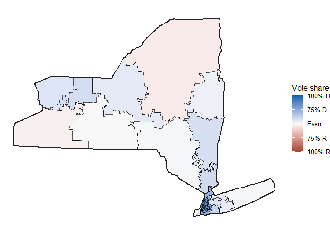

# Merge NY

## Goal: Merge custom districts 10 and eleven with other custom NY boundaries.

    tenAndEleven <- st_read("./shp/custom-bounds.shp")

    ## Reading layer `custom-bounds' from data source 
    ##   `C:\development\r\DAT4500-project\fletcher\merge-ny\shp\custom-bounds.shp' 
    ##   using driver `ESRI Shapefile'
    ## Simple feature collection with 2 features and 2 fields
    ## Geometry type: POLYGON
    ## Dimension:     XY
    ## Bounding box:  xmin: 562802.4 ymin: 4480943 xmax: 587760.3 ymax: 4510824
    ## Projected CRS: NAD83 / UTM zone 18N

    otherDists <- readRDS("./rds/NY_plans_best 1.rds")

    tenAndEleven <- tenAndEleven |>
      mutate(OBJECTID = OBJECTID + 15) |>
      mutate(DISTRICT = DISTRICT + 15)

    otherDists <- otherDists[, c("geometry", "district")]
    otherDists <- otherDists |>
      rename(DISTRICT = district) |>
      mutate(OBJECTID = DISTRICT)

    # Read geometry of districts.
    otherDists <- st_transform(otherDists, crs = st_crs(tenAndEleven))
    nyNewDistricts <- rbind(tenAndEleven, otherDists)

    # Read block level data. Change col names so that they match what is
    # expected by BlockManager.
    nyData2020 <- read.csv("../csv/ny_2020_vtd.csv")
    nyData2020 <- nyData2020 |>
      rename(GEOID = GEOID20) |>
      select(nrv, ndv, GEOID) |>
      mutate(GEOID = as.character(GEOID))

    # Get blocks and join block level data to it.
    nyBlocks2020 <- BlockManager$GetBlocks("NY")
    nyBlocks2020 <- BlockManager$JoinByGeoid(nyBlocks2020, nyData2020)

    # Consolidate blocks and their data into districts.
    nyNewDistricts <- BlockManager$ConsolodateDistricts(nyNewDistricts, nyBlocks2020)

    ## Warning: st_point_on_surface assumes attributes are constant over geometries

    ## Warning: There was 1 warning in `summarize()`.
    ## ℹ In argument: `across(where(is.numeric), sum, na.rm = TRUE)`.
    ## ℹ In group 1: `DISTRICT = 1`.
    ## Caused by warning:
    ## ! The `...` argument of `across()` is deprecated as of dplyr 1.1.0.
    ## Supply arguments directly to `.fns` through an anonymous function instead.
    ## 
    ##   # Previously
    ##   across(a:b, mean, na.rm = TRUE)
    ## 
    ##   # Now
    ##   across(a:b, \(x) mean(x, na.rm = TRUE))

    # Plot districts.
    ggplot() +
      geom_sf(data = nyNewDistricts, aes(fill = ndv / (ndv + nrv)), linewidth = 0.7) +
      scale_fill_party_c() +
      theme_map() +
      geom_district(data = nyNewDistricts, fill = NA, aes(group = TRUE), linewidth = 1.0)

    ## Warning in grid.Call(C_stringMetric, as.graphicsAnnot(x$label)): font family
    ## not found in Windows font database

    ## Warning in grid.Call(C_stringMetric, as.graphicsAnnot(x$label)): font family
    ## not found in Windows font database

    ## Warning in grid.Call(C_textBounds, as.graphicsAnnot(x$label), x$x, x$y, : font
    ## family not found in Windows font database

    ## Warning in grid.Call.graphics(C_text, as.graphicsAnnot(x$label), x$x, x$y, :
    ## font family not found in Windows font database

